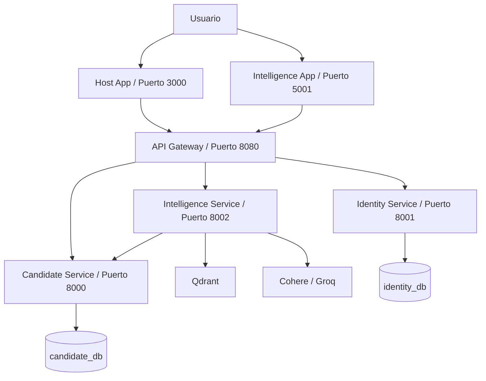

# Arquitectura de EasyJobs

EasyJobs es una plataforma de reclutamiento orientada a inteligencia artificial, organizada como un conjunto de microfrontends y microservicios. La idea principal es separar claramente las responsabilidades: una capa de experiencia de usuario, una capa de entrada y autenticación, y varios servicios de negocio que pueden evolucionar de forma independiente.

## 1. Visión general

La arquitectura actual combina:

- Microfrontends independientes con Vite + React
- Un API Gateway como punto de entrada único
- Servicios backend desacoplados para autenticación, candidatos e inteligencia
- Bases de datos separadas por dominio
- Integraciones con LLMs y un motor vectorial para búsqueda semántica

## 2. Capas de la solución

### 2.1 Capa de presentación

Está compuesta por dos microfrontends:

- Host App: aplicación principal para gestión de candidatos, login, registro y navegación general.
- Intelligence App: experiencia especializada para búsqueda semántica, carga masiva de CVs y generación de insights.

Ambos consumen el backend a través del API Gateway y se ejecutan como aplicaciones independientes con Vite.

### 2.2 Capa de borde y enrutamiento

El Gateway centraliza el acceso al sistema. Su responsabilidad principal es:

- recibir peticiones desde los microfrontends,
- validar JWT en el borde,
- enrutar a los servicios correctos,
- preservar trazabilidad con un correlation id.

El gateway no reemplaza la lógica de negocio de los servicios; solo actúa como proxy de entrada y control de seguridad básica.

### 2.3 Servicios de negocio

#### Identity Service

Responsable de:

- registro y login de usuarios,
- emisión de access token y refresh token,
- gestión de roles como recruiter o admin,
- validación local de JWT en cada servicio.

Este servicio es el origen de la identidad y de los tokens del sistema.

#### Candidate Service

Responsable de:

- CRUD de candidatos,
- autorización por rol,
- persistencia de los datos de negocio en PostgreSQL.

Cada candidato está asociado a un recruiter, que se obtiene del token JWT emitido por Identity.

#### Intelligence Service

Responsable de:

- ingestión masiva de datos vía CSV o ZIP con PDFs,
- extracción estructurada de metadata con LLM,
- indexación vectorial en Qdrant,
- búsqueda semántica de perfiles,
- generación de insights mediante agentes de IA.

Este servicio depende tanto del Candidate Service como de servicios externos como Cohere y Groq.

## 3. Flujo de comunicación

### 3.1 Autenticación

1. El usuario inicia sesión desde el Host App.
2. El gateway reenvía la petición a Identity.
3. Identity genera un JWT con claims de usuario y rol.
4. El cliente almacena el token y lo envía en las siguientes peticiones.
5. El gateway valida el token antes de permitir el paso.
6. Los servicios de negocio también validan el JWT de forma local.

Este diseño evita depender de Identity en cada request y permite que cada servicio sea resiliente y autónomo.

### 3.2 Gestión de candidatos

1. El Host App envía peticiones al gateway.
2. El gateway reenvía al Candidate Service.
3. Candidate Service persiste los datos en PostgreSQL.
4. Los datos quedan aislados por recruiter para evitar que un usuario vea registros de otros.

### 3.3 Inteligencia y búsqueda semántica

1. El Intelligence App o el servicio Intelligence recibe una carga o una búsqueda.
2. El servicio Intelligence envía datos al Candidate Service cuando requiere crear o recuperar candidatos.
3. Los candidatos procesados se indexan en Qdrant como vectores.
4. Las búsquedas semánticas consultan esos vectores para devolver perfiles similares.
5. Los insights usan LLMs con herramientas para consultar perfiles reales y calcular scores.

## 4. Modelado de datos

### 4.1 Identity DB

Guarda información de usuarios, credenciales y roles.

### 4.2 Candidate DB

Guarda los perfiles de candidatos, junto con datos como:

- nombre,
- email,
- habilidades,
- experiencia,
- resumen,
- recruiter_id.

### 4.3 Qdrant

Guarda embeddings y metadatos de los candidatos para búsquedas por similitud semántica. El índice está filtrado por recruiter_id para mantener el aislamiento de datos.

## 5. Decisiones de diseño importantes

- Database per service: cada servicio tiene su propia base de datos para mantener límites claros.
- JWT stateless: los servicios no necesitan consultar Identity por red para validar permisos.
- Gateway como borde: centraliza autenticación y enrutamiento.
- Microfrontends desacoplados: cada UI puede evolucionar de forma independiente.
- IA como capa complementaria: la inteligencia no reemplaza al dominio, sino que lo potencia.

## 6. Infraestructura y despliegue

El proyecto usa Docker Compose para levantar:

- PostgreSQL
- Qdrant
- Identity Service
- Candidate Service
- Intelligence Service
- Gateway

La estructura facilita el desarrollo local y la ejecución de los servicios en un entorno homogéneo.

## 7. Resumen ejecutivo

EasyJobs está diseñado como un sistema modular donde:

- los microfrontends ofrecen experiencias específicas,
- el gateway actúa como puerta de entrada,
- los servicios de negocio separan autenticación, candidatos e inteligencia,
- y la capa de IA añade valor a través de búsqueda semántica y generación de insights.

Esta arquitectura permite crecer el producto sin acoplar fuertemente los distintos dominios, y deja preparado el sistema para añadir más funcionalidades o nuevos módulos en el futuro.
