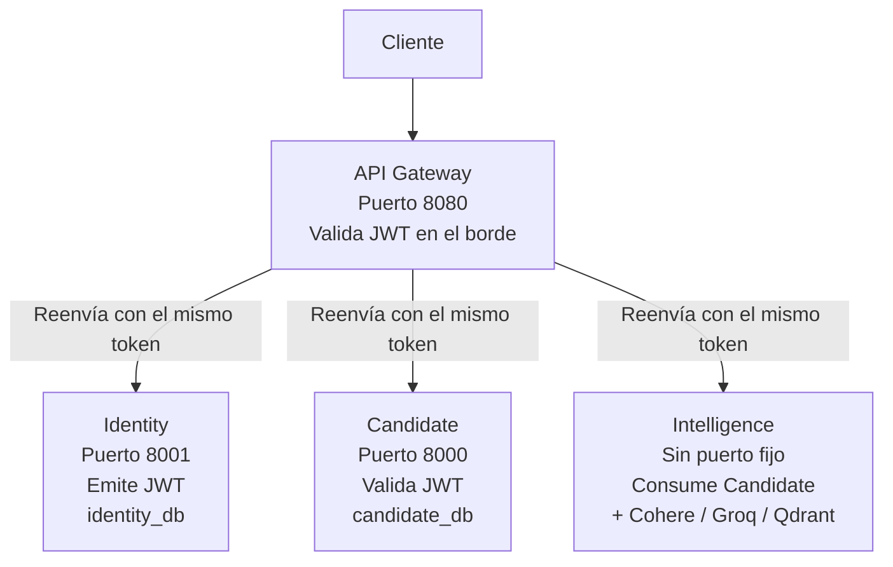

# Microservicios

Sistema diseñado para gestionar perfiles de candidatos, procesar grandes volúmenes de datos, realizar búsquedas semánticas y generar información valiosa mediante IA para los flujos de trabajo de reclutamiento.

La plataforma combina operaciones CRUD tradicionales con capacidades de IA modernas, como búsqueda vectorial, incrustaciones, clasificación de candidatos y análisis automatizado de perfiles.

## Arquitectura
El backend está construido utilizando FastAPI y sigue una arquitectura de microservicios compuesta por cuatro servicios independientes, cada uno con su propia base de datos (patrón database per service):

Cada servicio decodifica el JWT de forma independiente usando una JWT_SECRET_KEY compartida (no se consulta a identity por red en cada request). Esto hace que la autenticación sea stateless y que cada servicio sea responsable de su propia seguridad (defense in depth), incluso si el gateway ya filtró la mayoría del tráfico no autenticado.

## Services

### API Gateway
Punto de entrada único. Responsabilidades reales implementadas:

- Enrutamiento por proxy (httpx.AsyncClient persistente vía lifespan) hacia identity y candidate
- Validación de JWT en el borde (JWTAuthMiddleware), con lista blanca de rutas públicas (/auth/register, /auth/login, /auth/refresh)
- Trazabilidad de requests mediante correlation_id (debe registrarse después del middleware de auth, ya que Starlette ejecuta middlewares en orden inverso al de registro)

### Identity Service
Autenticación y autorización de toda la plataforma. Base de datos propia: identity_db.

- Registro y login de usuarios con password hasheado (bcrypt directo, no passlib, por incompatibilidad conocida entre passlib y bcrypt 4.x)
- Emisión de access token (corta duración) y refresh token (larga duración), ambos JWT con claim type para evitar que un refresh token se use como access token
- Roles soportados: admin, recruiter, candidate (RBAC)

### Candidate Service
Servicio empresarial principal. Base de datos propia: candidate_db.


- CRUD completo de candidatos (POST, GET, GET /{id}, PUT, PATCH, DELETE)
- Autorización por rol: lectura para cualquier usuario autenticado; creación/edición para admin/recruiter; borrado solo para admin
- Valida el JWT emitido por identity de forma local (misma JWT_SECRET_KEY), sin llamar a identity por red
- Suite de tests con pytest (SQLite en memoria, 95% coverage)

### Intelligence Service
Procesamiento de datos e IA sobre los perfiles de candidatos.


- ETL: ingesta masiva vía CSV (/etl/csv) y lotes de CVs en PDF dentro de un ZIP (/etl/cv-batch), con extracción estructurada por LLM para los PDFs
- Búsqueda semántica: embeddings con Cohere, indexados en Qdrant
- Agente de IA (/insights): usa langchain con ChatCohere como modelo principal y ChatGroq (llama-3.3-70b-versatile) como fallback automático, con herramientas (get_candidate_profile, search_similar_profiles, calculate_score) para razonar sobre candidatos reales

## Stack Tech

### Backend
- FastAPI
- Python 3.12+
- SQLAlchemy
- Alembic
- Pydantic

### Bases de datos
- PostgreSQL (una base lógica por servicio: candidate_db, identity_db)
- Base de datos vectorial (Qdrant)

### IA y búsqueda
- LangChain
- Cohere (chat + embeddings)
- Groq (fallback)
- Modelos de incrustación
- Búsqueda semántica

### Infrastructure
- Docker
- Docker Compose
- Nginx / API Gateway

## Tests
candidate cuenta con una suite de pytest (DB SQLite en memoria, sin dependencia de Postgres real):
```bash
cd services/candidate
pip install -e ".[dev]"
pytest --cov=app --cov-report=term-missing
```

Faltantes para intelligence