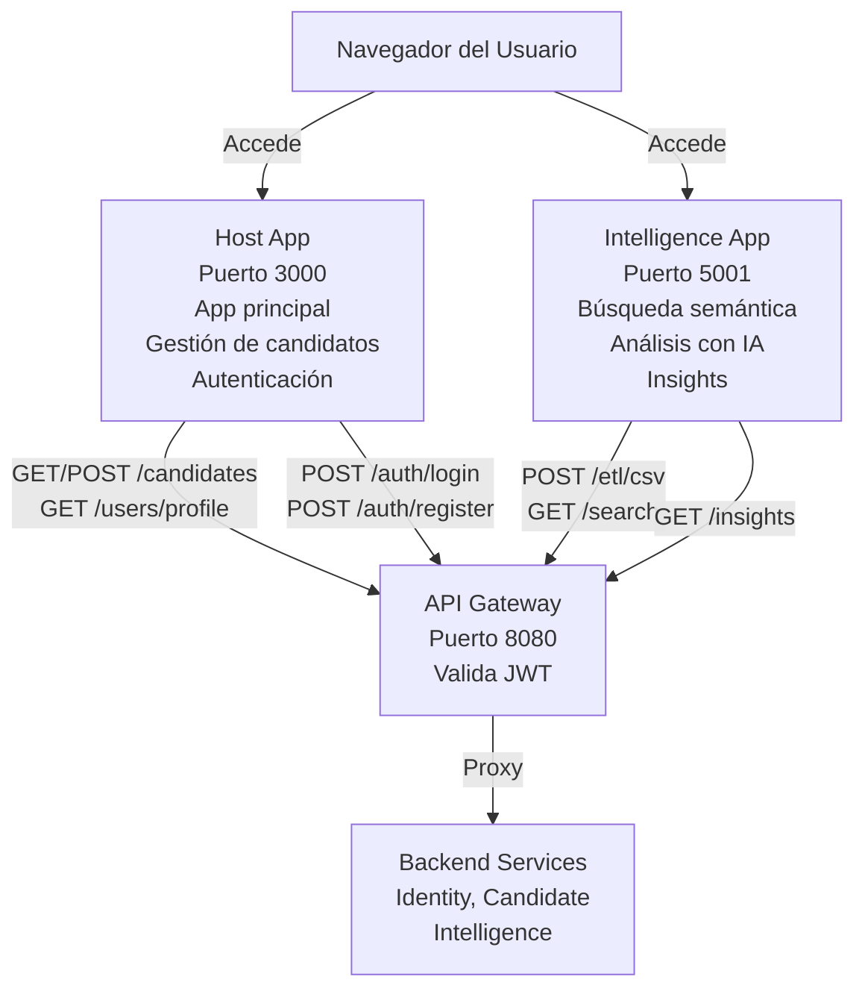

# Microfrontends

Sistema de interfaz modular construido con aplicaciones descentralizadas que consumen APIs de microservicios backend. La arquitectura permite que cada microfrontend sea independiente, escalable y mantenible, con su propio ciclo de desarrollo y despliegue.

La plataforma proporciona experiencias de usuario optimizadas para diferentes áreas del flujo de reclutamiento: gestión de candidatos, búsqueda inteligente, y análisis impulsado por IA.

## Arquitectura

El frontend está estructurado como múltiples aplicaciones Vite/React independientes que se comunican con el API Gateway. Cada microfrontend mantiene su propio estado, componentes y lógica de negocio:



## Microfrontends

### Host App
Aplicación principal y punto de entrada. Puerto 3000.

- Dashboard de gestión de candidatos
- Sistema de autenticación (login, registro, refresh token)
- CRUD de candidatos con interfaz intuitiva
- Gestión de perfiles de usuario
- Navegación entre módulos
- Persistencia de sesión con JWT

Dependencias clave: React Router (navegación), Axios (HTTP client), Tailwind CSS (UI), Zod (validación)

### Intelligence App
Módulo especializado en búsqueda y análisis inteligente. Puerto 5001.

- Búsqueda semántica de candidatos
- Carga masiva de CVs (ETL)
- Visualización de insights generados por IA
- Análisis comparativo de perfiles
- Integración con LLMs (Cohere, Groq)

Dependencias clave: React Router, Axios, Tailwind CSS, componentes reutilizables

## Stack Tech

### Frontend
- React 19
- TypeScript
- Vite (bundler y dev server)
- React Router v7
- Tailwind CSS v4
- Axios (HTTP client)
- Lucide React (iconos)
- date-fns (manipulación de fechas)
- Zod (validación de esquemas)

### Gestión de Dependencias
- pnpm (monorepo workspace)
- pnpm-lock.yaml (lock file compartido)

### Calidad de Código
- ESLint (linting)
- TypeScript strict mode

## Desarrollo

### Setup
```bash
cd web
pnpm install
```

### Ejecutar aplicaciones en desarrollo
```bash
# Host (puerto 3000)
cd web/host
pnpm dev

# Intelligence (puerto 5001)
cd web/intelligence
pnpm dev
```

### Build para producción
```bash
cd web/host
pnpm build

cd web/intelligence
pnpm build
```

### Linting
```bash
cd web/host
pnpm lint

cd web/intelligence
pnpm lint
```

## Consideraciones Arquitectónicas

- **Independencia**: Cada microfrontend es desplegable independientemente
- **Autenticación**: Usa JWT del API Gateway, almacenado en localStorage
- **Comunicación**: HTTP via Axios hacia API Gateway (puerto 8080)
- **Styling**: Tailwind CSS compartido con configuración consistente
- **Monorepo**: pnpm workspace para gestión centralizada de dependencias
